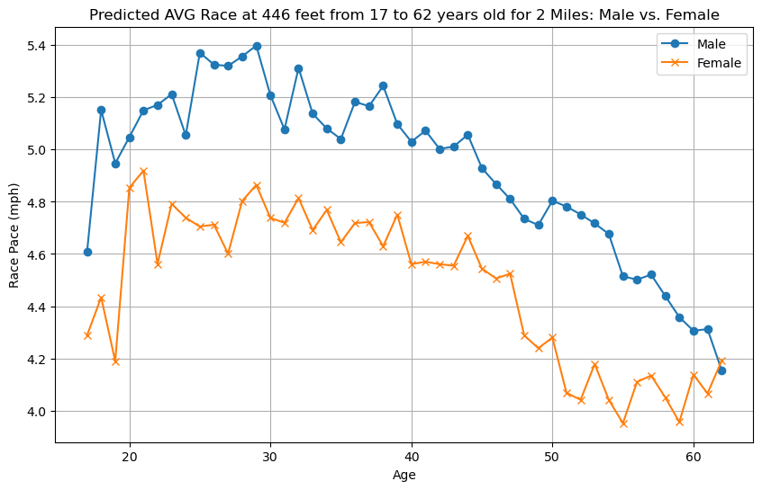
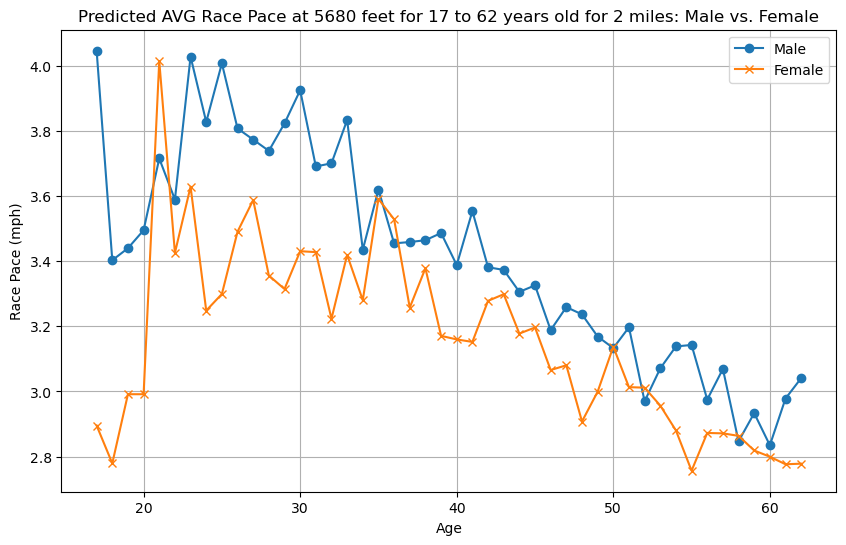

# Running_captstone

Running data - For Capstone

## Description
Ultra Marathon running data cleaned for the top 100 distance races in the United States. Data depicts specific athletes, years, events, distance, state of event, and race times as an example of the columns contained in the information.  The data shows the top 100 events data from 1963 to 2022.

There are 424,114 rows of data
Age Range is from 8 to 88 years old.
There are 128,168 unique runners.
There are 86,727 individual male runners. 41,480 individual female runners.
Distances range from 26.2 Miles to 100 Miles.
Average State elevations range from 469 feet to 6800 feet.

Data to Focus on for features: Gender, Age, Average State Elevation (feet), distance (miles)
Target data: mph (average race pace)

## Hypothesis
I had four individual hypothesis ran in regards to my data to understand if it affects 
    my target data or not.
    - Gender signficantly affects average race pace.
    - Age significantly affects average race pace.
    - Average State Elevation affects average race pace.
    - Distance affects average race pace.
In this all four hypothesis are my alternative as shown above.  I failed to reject all 
my hypothesis meaning all data had significant affects on my data.

## Table of Contents
- [Installation](#installation)
- [Usage](#Usage)
- [Contributing](#contributing)
- [License](#license)
- [Contact](#contact)

## Installation
### Prerequisites
- List of libraries required:
    - Pandas
    - statsmodels.api
    - scipy
    - sklearn
    - matplotlib
    - seaborn
    - numpy

### Steps
1. The data is very large and can be downloaded from:
https://www.kaggle.com/datasets/aiaiaidavid/the-big-dataset-of-ultra-marathon-running
The data is pulled from multiple sources including mains websites from:
    - https://ultrasignup.com
    - https://ultrarunning.com
2. Gather further information in regards to the data referenced you want to learn about.  I chose the top 100 races by distance (Not by time i.e. a 24 hour run) and only in the United States.  I then added elevation gain as well as the highest elevation point of each race.  I also included the state each event was located in.  For this I just used open source search engines.  I have added my newfound data to the data files.
3. Merge the data to clean.

## Usage
### Descirbe how I cleaned and transformed the data

### What visiualizations do we need to understand your topic?
    - Line plots of predictions and normal data

## Results

- Average Race Paces in Virginia for 31 mile runs
#### 

- Average Race Paces in Colorado for 31 mile runs
#### 

- Average Predicted Race Paces at Fort Eisenhower for 2 mile runs
#### 

- Average Predicted Race Paces at Fort Carson for 2 mile runs
#### 

### Present key insights
    - The data attempts to predict average race pace by gender, elevation, and distance of a race.
    - Males generally run faster than females on average.
    - Elevation, age, gender, and distance affect average race pace.
    - Races below marathons may be skewed due to not having data for those distances.  Adding more data to those lower distances can increase the accuracy of the predicted model.
    

### Tell us what you recommend
- Recommend gathering racing data at distances shorter than 26 miles.

### Tell us what future areas you might want/need to study
- Consider studying Terrain type of events, i.e. desert, mountain, forest, beach and seasons to see if that affects runners performance.  See if adding weight and height can affect if possible.

## Contributing
To contribute to this project, continue to add where to find pertinent data about each race to enhance further exploration of data analysis of Ultra Marathon Running.  Continue to provide race data from races ranging from 2 to 13 miles for better predictions.

## License
This project is licensed under the GPL-3.0 License.

## Contact

- Author - Justin Welch
- GitHub - https://github.com/jdwelch88