# Ultra Marathon Running

Affects on Running Performance - Galvanized Capstone Project

## Project Proposal to predict Race Pace based on specific variables
Do males and females need to be offered different allocations of time to finish an ultra marathon race due to elevation?
Does distance, elevation, and age affect running performance?

A caveat to the data is that we already know average race pace, however, can we predict average race pace given specific variables?

## Background & Motivation
As an avid runner, ultra marathon running is a passion of mine.  Ultra Marathon running is a particularly unique sporting event that requires endurance and stamina as well as proper training. Ultra Marathon running is particularly interesting when attempting to look at the data for races across multiple variables as to why others run better or worse.

## Data

Data was downloaded from Kaggle.com (https://www.kaggle.com/datasets/aiaiaidavid/the-big-dataset-of-ultra-marathon-running)

I cleaned the data to only pull the top 100 Ultra Marathon events by most participants in the United states.  I had to individually add the average state elevation of each race which included 25 states.

 - Years of data range from 1963 - 2022.
 - There are 424,114 rows of data.
 - Age Range is from 17 to 62 years old.
 - 128,168 unique runners.
 - 86,727 individual male runners. 41,480 individual female runners.
 - Distances range from 26.2 Miles to 100 Miles.
 - Average State elevations range from 469 feet to 6800 feet.

Data to Focus on for features: Gender, Age, Average State Elevation (feet), and distance (miles).
Target data: mph (average race pace)

To make this more focused to the military I am choosing high and low elevations of unique military bases.  Fort Eisenhower versus Fort Carson.

- To see how my data was manipulated and transformed please look in the data folder at UM_data_top_100.csv. 
- To see how the data was cleaned check the cleaning_data.ipynb
- My initial hypothesis testing was conducted in running_hypothesis.ipynb (most information discarded for my main analysis)
- My full analysis was conducted in all_100_running_hypothesis.ipynb
- My full regression analysis for my predictive model was conducted in the box_cox.ipynb
- I have one notebook checking how seasons affect running data in the adding_seasonal_data.ipynb (discarded for my main analysis)

## Hypothesis
I had four individual null hypothesis ran in regards to my data to understand if it affects my target data or not (average race pace).

### Null Hypothesis
    - Gender does not signficantly affects average race pace.
    - Age does not significantly affects average race pace.
    - Average State Elevation does not affects average race pace.
    - Distance does not affects average race pace.
In all of my hypothesis above I failed to reject all my null hypothesis meaning all data had significant affects on my data.

## MVP

    - Set data to specific units (intengers or floats) and not strings as they are continuous.  
    - Set males and females to zeros and ones for gender.
    - Compare linear regression, log model transformation, and other regression models to pick the best model for analysis.
    - Use best model to perform a predictive analysis on average race pace from my features.

## Analysis

- Initial Pair Plot Analysis is showing distribution of variables between males (1) and females (0).
- The pair plot likely shows that race pace generally decreases with increasing age for both genders.
- The plots show a distinct separation between the race paces of males and females, with males generally having faster paces.
- The rate at which race pace decreases with age might differ between males and females. This can be observed if the lines for males and females have different slopes.
- The age distribution for both genders might show that certain age groups have more data points, which could affect the model's estimates.

#### 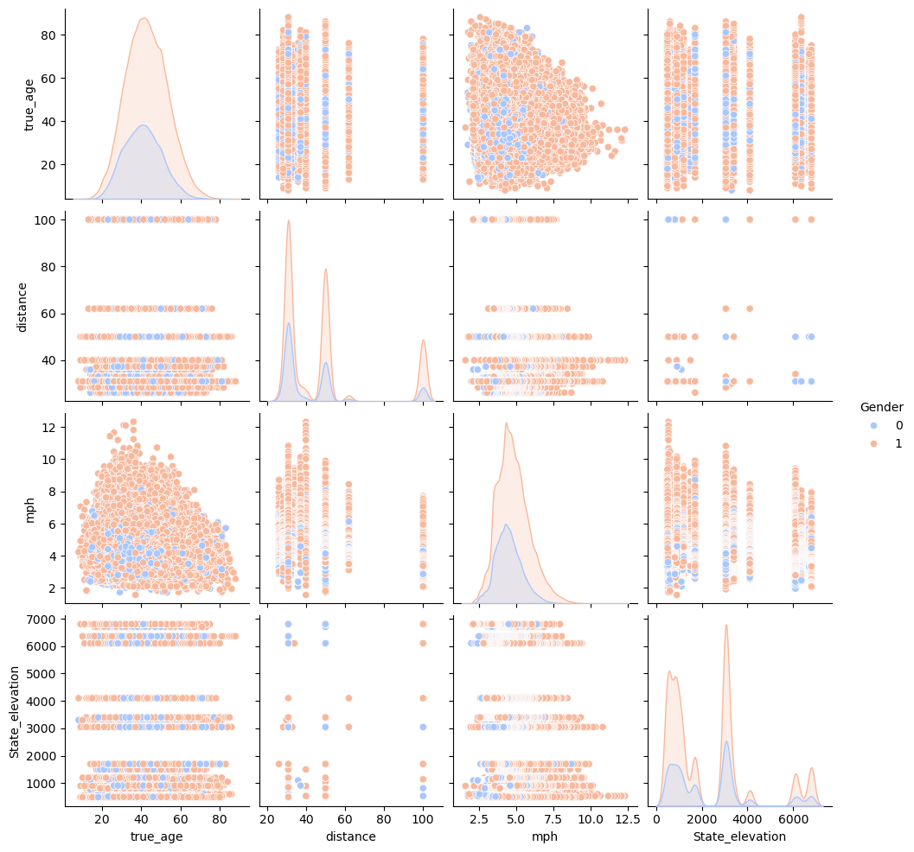

- Average Race Paces in Virginia and Colorado for 31 mile runs
    - This shows the actual data of events at 489 feet of elevation for 31 mile runs as well as events at 6800 feet.  We are comparing Virginia versus Colorado in this instance for males versus female running data from 17 to 62 years old. The data insists that gender, age, and elevation has an impact on running.  There are outliers which is why the average race pace was taken versus the actual race pace.  Taking the average accounts for the ages that generally perform better than others.
#### 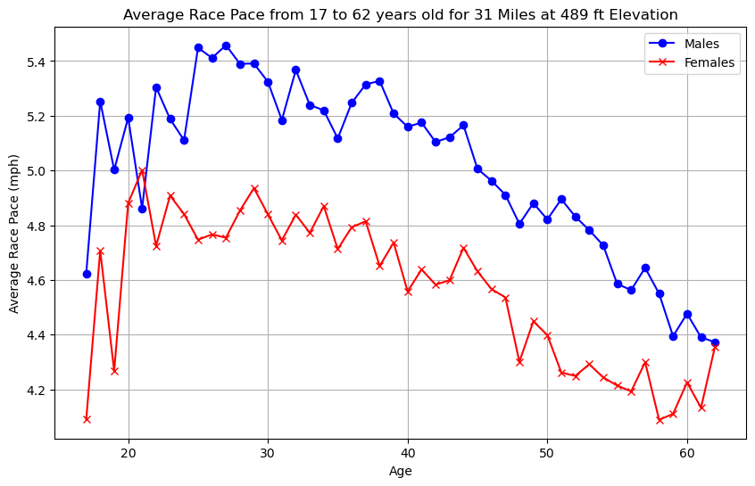
#### 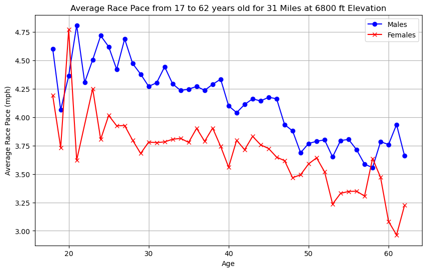

## Regression Analysis
- When conducting the regression analysis, Linear regression and Log transformation were both first tested.  The residuals plot of predicted values show a cone shape showing heteroscedasticity and plots of predicted vs actual values shows invalid predictions.  A Box Cox transformation was ultimately used due to it's homoscedasticity in the residuals and analysis of the predicted values versus the actual values.  Real data versus predicted data is compared from race paces versus age to show how each model compared to each other.  Multiple models were tested, however, the box cox transformation made the best estimate of predictions for analysis.

### Linear Regression

Upon first utilizing the Linear Regression model, it was utilized due to my target data being a continuous set of data.
- Calculated Mean Squared Error: 0.927758784169388

- The Linear Regression plot of the residuals below shows a heteroscedastic model, implying that my model might not be able to be accurate.  It shows a cone shape and the shape should be more homoscedastic.  This implies as the values go up for my prediction the less accurate they may be.

#### 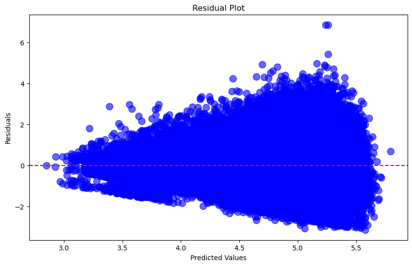

- In this model of the linear regression predictions we see that our predicted values of the average race pace are linear compared to the actual values.  This will show inconsistent results and ultimately show improper analysis fo the data. The thought process behind using another method is to find a transformation or regression model that will show more accurate results.

#### 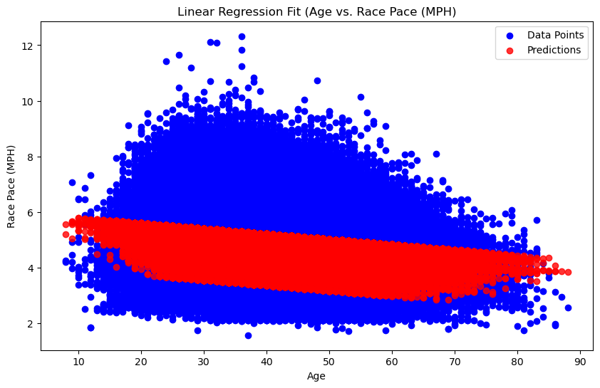

### Linear Regression with Log Transformation

A log transformation of the linear regression model was used to see if the data would fit better compared to my actual data.
- Calculated Mean Squared Error: 0.04051226254795319

While the MSE of this model was better fit to my data, it still showed linearity and was not best fit for the predictions.

- The linear regression plot with log transformation of the residuals below still showed heteroscedasticity in the model but did fit better.

#### 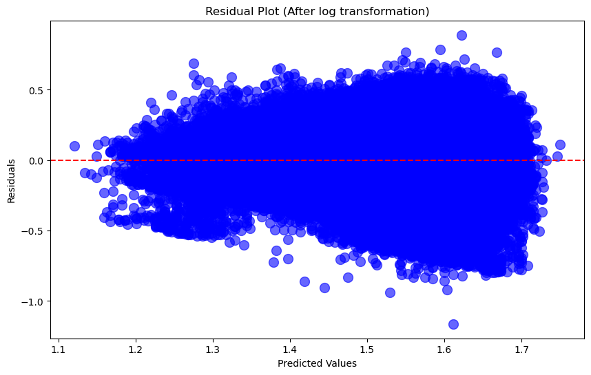

- We also see the same fit of actual data versus the predicted data from the transformation and looks very similar to the linear regression model.  A better transformation is needed for better and more accurate predictions.

#### 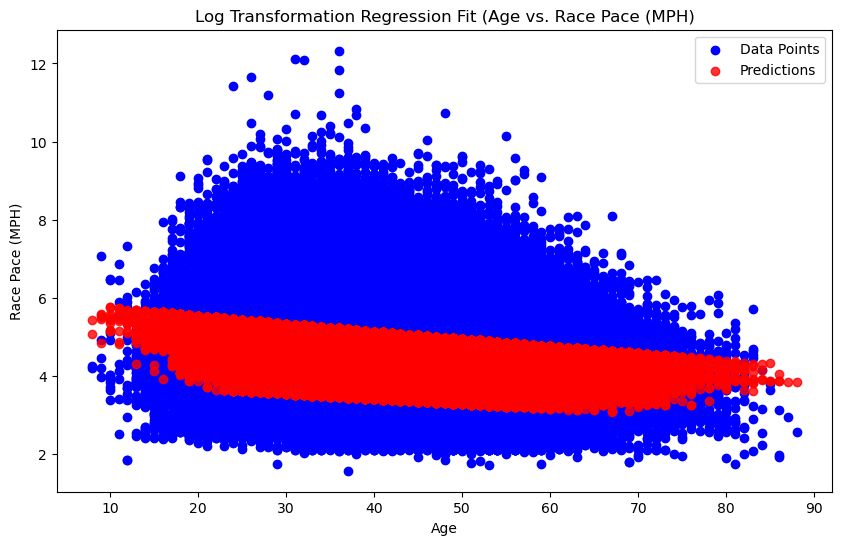

### Linear Regression with Box Cox Transformation

A box cox transformation was used for this predictive model ultimately. It gives normality of residuals, more constant variance (Homoscedasticity, better fit, and reduced MSE).
- Calculated Mean Squared Error: 0.012979636721184285
- The calculated MSE was better than the linear regression and log transformation.  This method was more effective at minimizing the descrepancies between actual and predicted race paces.

- When looking at the residuals plot we see the plot is more homoscedastic compared to the other residual plots for the linear regression models and log transformation.  How does the data look now compared to the fit of data to the predictions?

#### 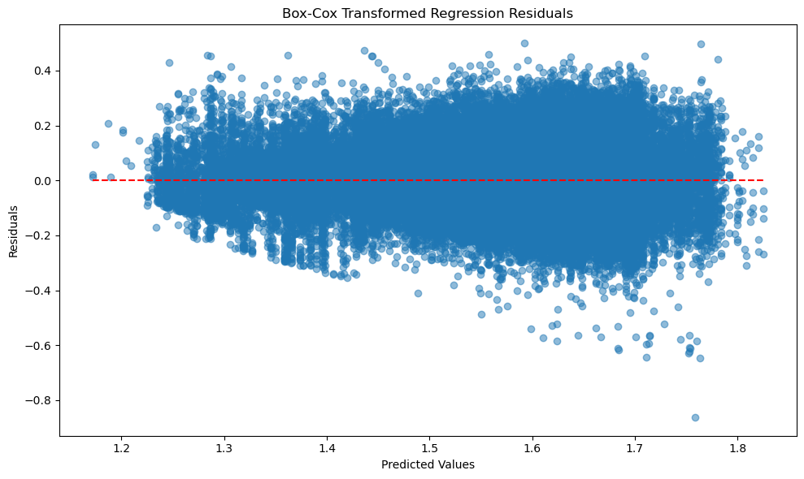

- The model created a better fit of the data.  Ultimately allowing the analysis of predicted paces fitting better.  There is now significant improvement to the accuracy and reliability compared to using untransformed linear regression.

#### 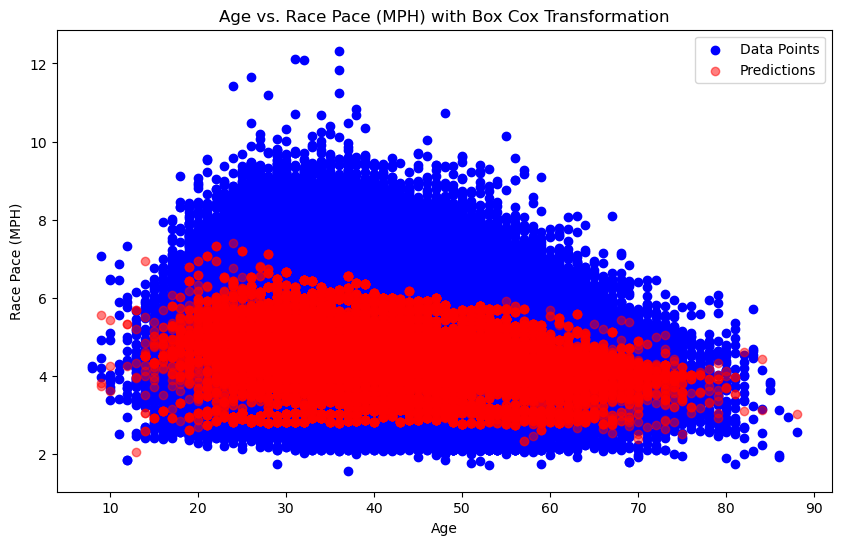

## Predicted Outcomes

- The predictive outcomes of running pace shows predicted race paces in miles per hour for Males Versus Females at a low Elevation at Fort Eisenhower of 446 feet versus a high elevation at Fort Carson of 5680 feet. The age range is from 17 to 62 years old.

- The first model shows racers running a 31 mile race and gives predicted average race pace.  The average difference between the average pace for males and females at low altitude are 0.42 mph and 0.51 mph at high altitude. The average difference gap is wide for this race distance.  Males generally run faster than females and as age increases the pace decreases.  Males and females run faster on average at lower altitudes in their late twenties while they run faster at higher altitudes in their mid twenties.

#### 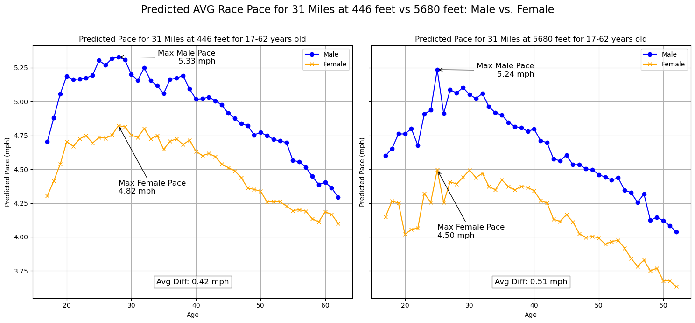

- The second model shows racers running a 50 mile race and gives predicted average race pace.  The average difference between the average pace for males and females at low altitude are 0.33 mph and 0.21 mph at low altitude.  The average difference gap did get more narrow. The trends are the same as 31 mile distances for ages and altitude for how fast they run on average.

#### 

- The third model shows racers running a 100 mile race and gives predicted average race pace. The average difference between the average pace for males and females at low altitude are 0.20 and 0.21 mph at high altitude.  The trends are the same as the 31 mile distances and 50 mile distances.  The average difference in race pace is more narrow suggesting that it is equally difficult to run an extremely long race for both males and females, potentially showing the need for stamina and endurance as well as physiological capabilities. However, we can see the average difference get smaller and the race paces narrow as the distances increase. The fastest average pace for males and females at low altitude are in their late twenties to early thirties and at high altitude their faster paces is in their early to mid twenties.

#### 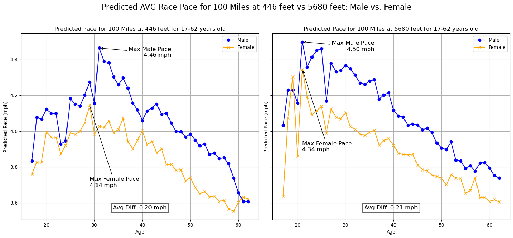

### Key Insights and Conclusion

All factors in my features affect a runners average pace: gender, distance, age, and elevation.

- Consistent trend that Males maintain higher paces at all distances, elevation, and age.
- The average difference of males vs female paces narrows at longer distances, indicating similar endurance capacities for ultra-distances, and as distance increases the pace decreases.
- Both genders generally show peak performance in their twenties with pace declining with age.
- Males and females run faster, on average, in their late twenties to early thirties at lower elevation. They run faster, on average, in their early to mid twenties at higher elevation.

Runners should be given different allocations of time to finish a race based off of elevation, distance, gender, and age.  Coaches and athletes can utilize this data to create flexible training regimes for runners based off elevation, gender, age, and distance they are training for.

### Recommendations
- Recommend gathering racing data at distances shorter than 26 miles.  Where are the racers coming from when running different altitudes?  Are they coming from an area where they are already acclimated for high altitude?

### Future areas of study
- Consider studying Terrain type of events, i.e. desert, mountain, forest, beach and seasons to see if that affects runners performance.  See if adding weight and height can affect if possible.
- Ultimately to keep this military related, do an analysis of the ACFT two mile run for each age group of males versus females at Fort Carson and Fort Eisenhower to compare how each group does. Include height and weight.

## Contributing
To contribute to this project, continue to add where to find pertinent data about each race to enhance further exploration of data analysis of Ultra Marathon Running.  Continue to provide race data from races ranging from 2 to 13 miles for better predictions.

## License
This project is licensed under the GPL-3.0 License.

## Contact

- Author - Justin Welch
- GitHub - https://github.com/jdwelch88
